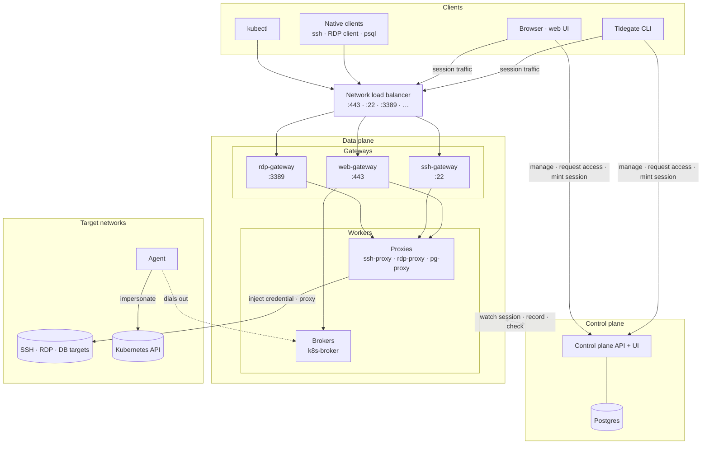
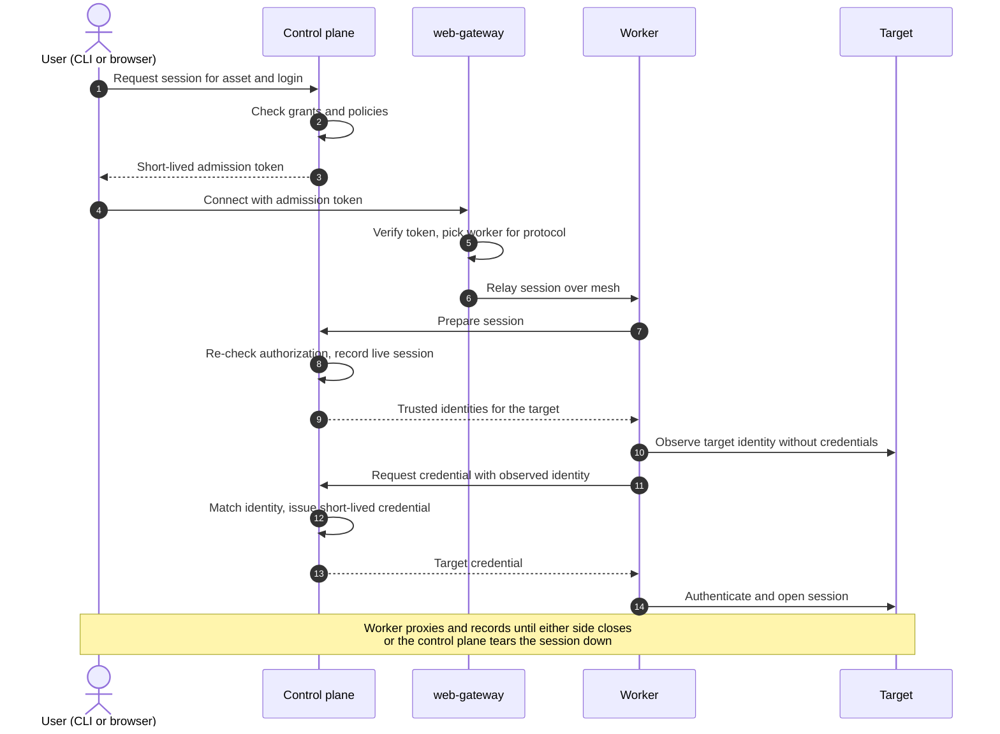
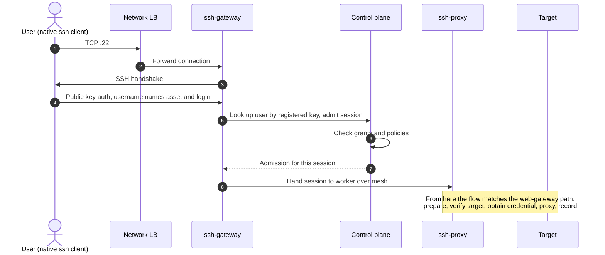
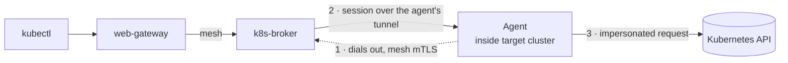
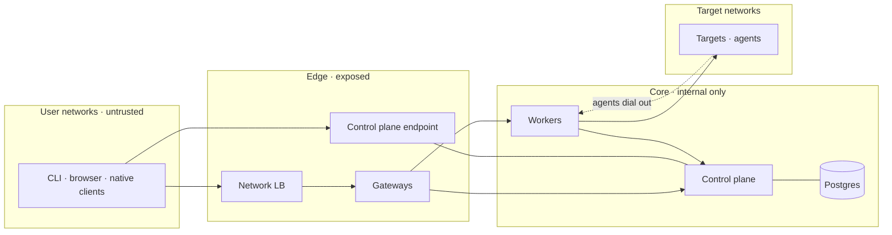
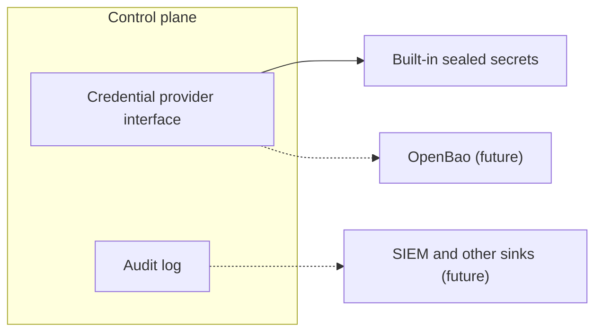

# TEP-0002: Architecture vision

## Summary

Tidegate is a cloud native privileged access management (PAM) system. It grants just-in-time (JIT), just-enough (JEA) access to infrastructure assets such as servers, databases, remote desktops, and Kubernetes clusters. Users hold no standing credentials. Access is requested, approved, limited in time and scope, injected into the session by Tidegate, and recorded.

This TEP records the high-level architecture the maintainers agreed on. A control plane backed by Postgres makes every access decision and is managed through a CLI and a web UI. A data plane carries the actual sessions. It has one HTTPS entry point, the web-gateway, plus optional protocol gateways that let native tools such as `ssh` or an RDP client connect without a Tidegate client. The gateways hand sessions to workers. A worker is either a proxy that reaches its targets directly or a broker that reaches them through an agent running near the target. Optionally, a network load balancer in front of the data plane routes each port to the matching gateway.

The design follows [jumpgate](https://github.com/trevex/jumpgate), an earlier project by one of the maintainers, and extends it with protocol gateways for native clients. The ssh-gateway takes its model from [Warpgate](https://github.com/warp-tech/warpgate), an open source SSH and HTTP bastion that accepts unmodified SSH clients. External secret stores such as OpenBao and external audit log sinks are planned and shape the design, but their details are left to future TEPs.

## Motivation

Tidegate needs an agreed architecture before work on individual components starts. Without one, each component TEP would have to argue its own assumptions about trust boundaries, how sessions reach targets, and which component owns which decision. This TEP gives those later proposals a shared frame to refer to and to amend.

The architecture also has to support a requirement that jumpgate did not address. Jumpgate routes all session traffic through its own CLI or browser, so users have to change their tools. Many users and automation scripts depend on plain `ssh`, `scp`, RDP clients, and database clients. Supporting those clients unchanged makes Tidegate easier to adopt and removes a reason to keep standing credentials around for tooling that cannot use a custom client.

### Goals

- Define the components of Tidegate, what each one is responsible for, and how they connect.
- Define which components are exposed to users and which are internal.
- Describe the path of a session from request to teardown at a level that later TEPs can refine.
- Describe how native clients such as `ssh` and RDP clients fit into the architecture.
- Identify the extension points for external secret stores and external audit log sinks among others.

### Non-goals

- Choosing implementation languages, libraries, or wire formats. Component TEPs make those choices.
- Specifying APIs, data models, or the access model. Each gets its own TEP.
- Designing how native clients authenticate to protocol gateways in detail. This TEP sets the direction for SSH and leaves the rest to dedicated TEPs.
- Designing integrations with external secret stores or audit log sinks.
- Committing to a fixed list of supported protocols. Protocols named in this TEP are examples.
- Defining deployment topologies such as multi-region or high-availability layouts.

## Proposal

### Design principles

These principles guide the component design. Component TEPs that depart from one of them need to say why.

- Zero standing access. Users and workers hold no long-lived credentials to targets. A target credential is issued per session, after authorization, and expires no later than the access behind it.
- The control plane decides, the data plane enforces. Policy, grants, secrets, and the audit log live in the control plane. Gateways and workers ask the control plane (or verify and trust short lived tokens from the control plane) before they act and keep no authorization state of their own.
- Fail closed. If the control plane, the recording store, or a target identity check is unavailable or returns an unexpected result, the session is refused or torn down.
- Continuous authorization. A session stays authorized only while the grant or binding behind it holds. Revoking access ends live sessions as well as blocking new ones.
- Verify the target before releasing a credential. A worker proves the target's identity, for example by its SSH host key or TLS certificate, before the control plane issues a credential for it.
- Record every session. Session activity is recorded and linked to the audit trail.
- Minimal exposed surface. Only the control plane endpoint and the gateways are reachable from user networks. Workers, agents, and the database are not.

### Components

#### Control plane

The control plane decides every access question in Tidegate. It owns identities, the asset catalog, roles and policies, access requests and approvals, time-limited grants, stored secrets and certificate authorities, the audit log, and the registry of live workers and sessions. It keeps all of this state in Postgres, so control plane replicas are stateless and scale horizontally against one database.

The control plane exposes two interfaces:

- A user-facing API and the web UI, reached by the CLI and the browser on their own endpoint. Users manage assets and policies, request and approve access, and mint session admission tokens here.
- An internal API on the mesh for gateways and workers. They use it to register, look up routing information, prepare sessions, obtain target credentials, and report session events.

#### Postgres

Postgres is the control plane's only source of truth. Operators run it with the guarantees a security system's database needs: replication, backups, and point-in-time recovery. No other component connects to it.

#### CLI and web UI

The CLI and the web UI are the two management clients. Both cover the same access loop: find an asset, request access, approve requests, and start a session. The CLI also starts sessions for protocols that need a local helper, such as a kubeconfig credential plugin for `kubectl`. The web UI starts browser-based sessions, such as an in-browser terminal or remote desktop.

#### Network load balancer (optional)

A layer 4 load balancer is the single public entry point for session traffic. It forwards each port to the gateway for that protocol, for example:

| Port | Gateway | Typical clients |
|---|---|---|
| 443 | web-gateway | Tidegate CLI, browser sessions, `kubectl` |
| 22 | ssh-gateway | `ssh`, `scp`, `sftp`, SSH automation |
| 3389 | rdp-gateway | Native RDP clients |
| 5432 | pg-gateway | `psql` and other Postgres clients |

The load balancer passes TCP through unchanged, so TLS and protocol handshakes terminate at the gateways. Gateways added later get a port on the same load balancer.

#### Gateways

Gateways are the only data plane components exposed to users. They admit sessions and route them to a worker. They hold no credentials to targets and keep no authorization state beyond the session they are carrying.

The web-gateway carries all HTTPS-based session traffic. It accepts tunneled sessions from the CLI, WebSocket sessions from the browser, and Kubernetes API requests from `kubectl`. Each request carries a short-lived admission token minted by the control plane. The web-gateway verifies the token, selects a worker that serves the session's protocol, and relays bytes between the client and the worker. It does not terminate the target protocol, so adding a protocol that can be tunneled over HTTPS needs a new worker but no web-gateway change.

Protocol gateways accept native clients on the protocol's own port. A native client cannot present a Tidegate admission token, so a protocol gateway speaks enough of its protocol to authenticate the user and find out which asset and login the user wants. It then asks the control plane to admit the session and hands it to a worker as the web-gateway would. The ssh-gateway, pg-gateway and rdp-gateway are the first expected protocol gateways. Others are added when a protocol has enough users of native tooling to justify one.

#### Workers

Workers carry sessions to targets. Every worker registers with the control plane over the mesh, advertises what it can serve and how much capacity it has, and reports session start and end. For each session a worker re-confirms authorization with the control plane, verifies the target's identity, obtains a target credential, injects it, proxies the session, and records it. Workers hold a target credential only for the lifetime of one session.

Tidegate has two kinds of worker:

- A proxy connects to its targets directly over the network. It suits targets the data plane can reach, such as SSH servers, Windows hosts over RDP, and databases. Targets need no software installed.
- A broker never connects to targets itself. An agent installed next to the target dials out to the broker and keeps a tunnel open, and the broker sends sessions down that tunnel. This suits targets that accept no inbound connections from the data plane or have restricted authentication options, such as Kubernetes clusters in public clouds. The Kubernetes agent forwards requests to its cluster's API server and impersonates the Tidegate user, so the cluster's own RBAC decides what the user can do.

Each worker serves one protocol. That keeps protocol handling, credential injection, and recording for one protocol in one place, and lets a protocol be added without touching other workers.

#### Agents

An agent runs inside a target environment and connects outward to a broker. It enrolls with the control plane using a single-use token to obtain its mesh identity, so it never holds a standing credential issued at install time. Because it only dials out, the target network needs no inbound firewall rule for Tidegate.

#### Internal mesh

Gateways, workers, agents, and the control plane talk to each other over a mutually authenticated TLS mesh. Each component has a workload identity issued by a control plane certificate authority, and every connection checks the peer's identity against the role it expects. A gateway accepts only workers as session targets, and the control plane accepts session calls only from workers, so a compromised gateway cannot impersonate a worker.

### User stories

- An on-call engineer runs `tidegate connect deploy@web-01.prod`, gets a 30-minute grant approved by a teammate, and lands in a shell. The engineer never sees a password or key for `web-01`.
- A developer who prefers plain OpenSSH registers a public key on their Tidegate user once and then runs plain `ssh` against the Tidegate SSH endpoint. The session goes through the ssh-gateway with the same authorization, credential injection, and recording as a CLI session.
- An administrator opens a remote desktop to a Windows server in the browser, or from a native RDP client through the rdp-gateway.
- A platform engineer runs `kubectl` against a cluster in a customer network that accepts no inbound connections. The request reaches the cluster through a broker and the agent inside the cluster.
- A security lead revokes a grant during an incident. Every live session that depended on it ends within seconds.
- An auditor retrieves the recording and audit trail of a session, including who approved the access.

### Risks and mitigations

- The control plane is a single point of failure for new sessions, because every session needs its approval. Control plane replicas are stateless and scale out, and Postgres is run with high availability. An outage blocks new sessions instead of letting them through unchecked.
- Protocol gateways enlarge the exposed surface, because each one parses a complex protocol from unauthenticated clients. Each protocol gateway has its own TEP with a dedicated security review, runs with no target credentials, and can be disabled by closing its load balancer port.
- A compromised worker could misuse the credentials of sessions it is carrying. Credentials are per session and short-lived, and the control plane only issues them for a session it just re-authorized on a target the worker just verified.

## Design details

### How a session flows through the web-gateway

The CLI and browser path is the reference flow. The control plane authorizes twice: once when it mints the admission token, and again when the worker prepares the session. The second check closes the gap between minting and connecting, and binds the session to the worker that will carry it.

### How a session flows through a protocol gateway

A native client takes the same path from the gateway onward. The difference is at the front: the protocol gateway authenticates the user inside the native protocol and obtains admission from the control plane on the user's behalf. The SSH flow below is an example of how a protocol gateway fits the architecture. Each protocol, SSH included, gets its own TEP that defines its actual flow.

This section is illustrative. Where a protocol TEP exists, it is the reference for that protocol's flow and takes precedence over this section.

In this example, the ssh-gateway follows the model of Warpgate. A user registers one or more SSH public keys on their Tidegate user, through the CLI or the web UI. The user then connects with a plain `ssh` client and names the target asset and login in the SSH username, the way Warpgate encodes user and target in the username. The ssh-gateway checks the presented key against the keys registered for that user, asks the control plane to admit the session, and hands it to an ssh-proxy. The user's key only proves identity to Tidegate. It is never installed on a target, and the target hop uses a per-session credential issued by the control plane as in every other flow.

This model keeps `ssh`, `scp`, `sftp`, `rsync`, and SSH-based automation working with only a changed host and username. The ssh-gateway TEP decides whether to adopt it and settles details such as the username syntax, whether keyboard-interactive authentication can add a second factor or a browser-confirmed login, and how access requests are raised when a user connects without a current grant.

Other protocol gateways need their own authentication design, defined in their protocol TEPs, because protocols such as RDP and Postgres have no equivalent of a user-held public key. Candidates include a short-lived credential obtained through the CLI, an interactive login inside the protocol, or a ticket carried in a field the client already sends.

### Brokers and agents

The broker and agent pair reverses the direction of the connection so Tidegate never needs inbound access to a target network.

Agents advertise the assets they serve through their broker, and the broker reports them to the control plane. The control plane uses that registry to tell gateways which broker reaches a given asset. The pattern generalizes to any target that cannot accept inbound connections, though Kubernetes is the first planned use.

### Continuous revocation

The control plane keeps a ledger of live sessions and the grant or binding each one depends on. When an authorization changes, for example a grant expires or is revoked, a role binding is removed, or a user is deactivated, the control plane re-evaluates the affected sessions and tells the owning worker to end any that no longer hold. A periodic sweep re-checks all live sessions as a backstop in case a change notification is lost. Gateways carry no session decisions, so they need no revocation signal: when the worker closes the session, the gateway's connection closes with it.

### Trust zones

Only the edge zone accepts connections from user networks. Workers, the database, and the recording store accept connections only from inside the core zone. Targets reached through agents accept no inbound connections from Tidegate at all.

### Future extensions

Two extension points are part of the vision, with their designs left to later TEPs:

- External secret stores. Target credentials are issued through a credential provider interface inside the control plane. The first provider uses secrets sealed in Postgres. Later providers can read from or delegate issuance to external stores such as OpenBao, so organizations can keep existing secret management. Workers are unaffected because they always receive credentials from the control plane.
- External audit log sinks. The control plane writes audit events to its own tamper-evident log first. Sinks such as a SIEM receive a copy from that log, so a failing sink delays export but never loses an event or blocks a session.

## Security considerations

- Trust boundaries. The edge zone (load balancer, gateways, control plane endpoint) is the only part reachable from user networks. The control plane is the most trusted component and the only one with access to Postgres, stored secrets, and certificate authorities. Workers are trusted to handle one session's credential at a time. Agents are trusted only for their own target. Protocol gateways move part of user authentication into the data plane, which is a new boundary compared with jumpgate; their TEPs must define what a gateway may assert to the control plane about a user. SSH public keys registered on a user authenticate that user to Tidegate only. A stolen private key lets an attacker act as the user within the user's current grants, so the ssh-gateway TEP must address key revocation and whether a second factor is required for sensitive assets.
- Privilege. Access comes from time-limited grants or standing bindings evaluated by the control plane. Target credentials are minted per session and expire no later than the authorization behind them. Live sessions end when that authorization ends.
- Credentials and secrets. Users never receive target credentials. Workers receive one per session, only after the target's identity is verified. Stored secrets and CA keys are encrypted at rest in Postgres and never returned through the API. Mesh identities are short-lived certificates issued by the control plane.
- Audit. Every access request, approval, grant, credential issuance, session start, session end, and forced teardown is written to a tamper-evident audit log in the control plane. Sessions are recorded by workers, and retrieving a recording is audited.
- Failure behavior. Every component fails closed. If the control plane is unreachable, gateways and workers refuse new sessions. If recording cannot start or fails mid-session, the worker ends the session. If target identity does not match a trusted identity, no credential is issued.
- Threat model. In scope are a malicious or compromised user account, a compromised approver, a network attacker between any two components, an attacker impersonating a target, and a compromised gateway, worker, or agent. The design limits each: approvals require a second person, the mesh authenticates every hop, target identity verification stops impostor targets, and a compromised data plane component holds at most the credentials of sessions it is carrying at that moment. A compromised control plane or Postgres is out of scope for mitigation at this level, which is why both stay internal and minimal.

## Compatibility and upgrade

Tidegate has no released version yet, so this TEP has no compatibility impact. Component TEPs define compatibility rules for their APIs and formats.

## Test plan

This TEP defines no code. Each component TEP includes its own test plan, and an end-to-end test environment that runs the control plane, gateways, workers, and sample targets together is expected to follow from the first component TEPs.

## Rollout

The architecture is built incrementally through component TEPs. A likely order, subject to those TEPs:

1. Control plane with Postgres, CLI, and web UI (optional, API/CLI first).
2. web-gateway and a first proxy worker.
3. Broker and agent for targets without inbound access.
4. Protocol gateways for native clients, starting with SSH.
5. External secret stores and audit log sinks.

## Drawbacks

- The architecture has many moving parts for a small team: a control plane, several gateways, one worker per protocol, and agents. Each protocol adds a worker, and each native protocol adds a gateway as well.
- Protocol gateways duplicate some protocol handling that workers already do, and they put protocol parsers on the internet-facing edge.
- Every session depends on the control plane being available. That is deliberate, but it makes control plane availability an operational requirement for users.

## Alternatives

A single gateway that terminates every protocol would remove the split between gateways and workers. It would also put credential handling and recording for all protocols in the one internet-facing component, which is the opposite of the minimal exposed surface principle.

Exposing workers directly to clients would remove the gateways. Every worker would then be an internet-facing service with target credentials, and routing to the right worker would move into clients and DNS.

Using agents for every target would make all access outbound-only. It would also require installing software on every target, which many organizations cannot do for appliances, managed databases, and legacy hosts. Supporting both proxies and brokers keeps agentless access for reachable targets and outbound-only access where it is needed.

Supporting only the Tidegate CLI and browser, as jumpgate did, would avoid protocol gateways. It would also force users and automation off their existing tools, which this TEP treats as a barrier to adoption.

## Unresolved questions

- How do native clients of protocols other than SSH authenticate to their protocol gateways? Candidates are listed under [How a session flows through a protocol gateway](#how-a-session-flows-through-a-protocol-gateway).
- What is the exact SSH username syntax for naming the asset and login, and how does it handle asset paths that contain the separator character?
- How is work split between a protocol gateway and a worker? A protocol gateway must terminate the native protocol to authenticate the user and learn the target. It could then re-originate the session to a worker, or hand the established connection over. The choice affects where recording happens and how much protocol code the gateway carries.
- Which identity providers does the control plane support for user login, and is OIDC the default?
- Can workers run in remote networks, close to their targets, and dial out to the core like agents do? This would allow proxies in segmented networks without opening inbound paths from the core.
- How are protocol gateways other than SSH addressed when one port serves many targets, for example by per-asset DNS names or a field inside the protocol handshake?

## Implementation history

- 2026-10-01: First draft, based on the architecture agreed in a maintainers' meeting.
