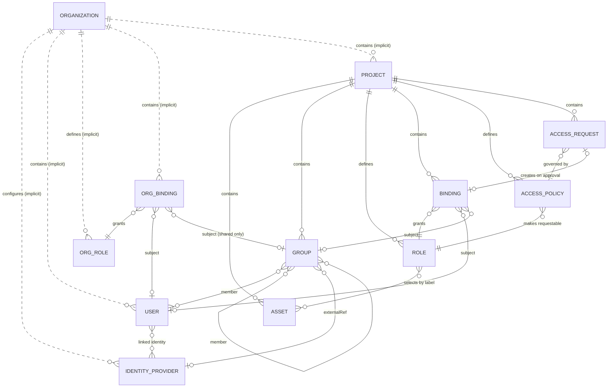
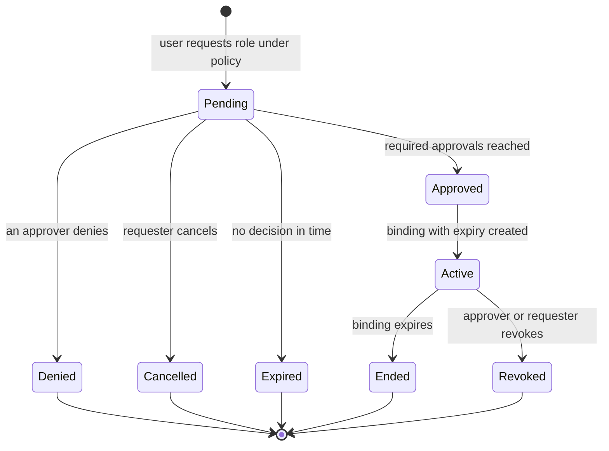
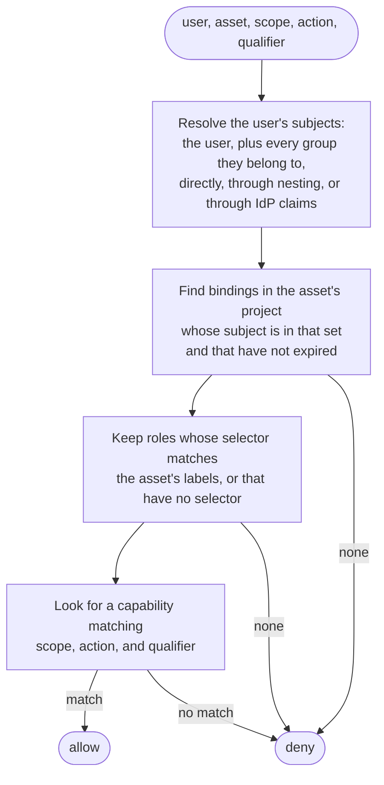

# TEP-0003: Data and authorization model

## Summary

This TEP defines the resources the Tidegate control plane stores and the rules it uses to decide who may do what. It is a starting model agreed over several maintainer meetings, and later TEPs are expected to refine it.

The organization is the top level of the model. For now a Tidegate instance serves exactly one organization, which stays implicit: it is not stored and does not appear in the API. The organization holds users, identity providers, and organization roles that govern administration, such as who manages users or creates projects. All access to infrastructure lives in projects. A project holds assets, groups, roles, bindings, and access policies. Assets carry labels, and a project role selects assets by label and grants capabilities on them, such as logging in over SSH as `root`. A binding gives a role to a user or group, either as standing access or for a limited time after an approved access request.

The model borrows its shape from Kubernetes RBAC. An organization role works like a ClusterRole, a project works like a namespace, and a project role works like a Role.

## Motivation

Every component described in [TEP-0002](../0002-architecture/README.md) depends on the control plane's data model. The API, the CLI, the web UI, the access request flow, and the authorization checks made on behalf of gateways and workers all need the same vocabulary. Agreeing on it before the API TEPs start keeps those TEPs from inventing incompatible versions of the same concepts.

Jumpgate, Tidegate's predecessor, organized assets in a folder tree and let roles cascade down folders through rewrite rules. That model is expressive, but access depends on where an asset sits in the tree and on which rules a role carries, which makes it hard to see why someone has access. The maintainers want a flatter model in which access follows from a short chain of explicit records: a binding, a role, a label selector, and a capability. Labels also suit assets that are discovered or managed by automation, because tooling can set labels without placing assets in a hierarchy.

The model also has to separate administration from access. In a PAM system, the people who manage users and identity providers should not gain shell access to production as a side effect, and the people who own a project should not be able to change organization settings.

### Goals

- Define the resources the control plane stores, their scope (organization or project), and how they reference each other.
- Define how an access decision is evaluated, from a user's identity to a capability on an asset.
- Define how group membership is derived from identity provider claims, and keep that mapping explicit.
- Define the lifecycle of just-in-time access, from policy to request, approval, time-limited binding, and revocation.
- Define the rules that prevent a user from granting more access than they hold.
- Define a declarative resource format that can bootstrap a new instance.
- Avoid choices that would block hosting multiple organizations in one instance as a future feature.

### Non-goals

- Database schemas, API definitions, and wire formats. A future TEP might define them.
- The full list of protocol scopes, actions, and qualifiers. Each worker TEP defines the capabilities for its protocol.
- Asset connection details, credential configuration, and target identity pinning. These belong to the asset catalog and worker TEPs.
- Identity provider protocols. This TEP assumes OIDC for examples but does not choose the supported set.
- Implementing the organization as a resource, and multi-organization support. The organization is described so the model has room for it, but the first implementation stores no organization record or organization identifier, and the API does not expose one.
- Audit event formats.

## Proposal

### Resources at a glance



| Resource | Scope | Kubernetes counterpart | Purpose |
|---|---|---|---|
| Organization | Instance | Cluster | Top-level tenant. Implicit for now: one per instance, not stored and not exposed in the API. |
| IdentityProvider | Organization | none | Configuration for an external identity provider, such as an OIDC issuer. |
| User | Organization | User | A person or service account that can sign in. |
| OrgRole | Organization | ClusterRole | A set of governance capabilities, such as managing users or creating projects. |
| OrgBinding | Organization | ClusterRoleBinding | Gives an OrgRole to a user or a shared group. |
| Project | Organization | Namespace | Boundary for assets and the access rules that apply to them. |
| Group | Project | none | A set of users and other groups. Optionally shared with other projects, optionally mapped to an IdP group. |
| Asset | Project | none | A target that Tidegate brokers access to, such as an SSH host, a database, or a cluster. Carries labels. |
| Role | Project | Role | A label selector and a set of capabilities. |
| Binding | Project | RoleBinding | Gives a Role to a user or group, permanently or until an expiry time. |
| AccessPolicy | Project | none | Says who may request a Role, who approves, and for how long. |
| AccessRequest | Project | none | A user's request for a Role under an AccessPolicy. |

### Organization

An organization is the tenant boundary. Users, identity providers, organization roles and bindings, and projects belong to one organization, and no reference crosses from one organization to another.

The organization is part of the model but will not be implemented for now. A Tidegate instance serves exactly one organization, and that organization is the instance itself. The control plane stores no organization record and no organization identifier on other records, and neither the API nor the declarative format names an organization. Organization-level resources are therefore unique across the instance.

Hosting several organizations in one instance is a possible future feature. It would make the organization an explicit resource and require a migration that assigns existing records to a default organization and scopes names and queries by it. This TEP avoids choices that would make that harder: no reference relies on there being only one organization in a way that a default organization could not satisfy.

### Identity providers and users

An IdentityProvider resource configures an external identity source, for example an OIDC issuer with its client settings and the name of the claim that carries group membership. An organization can configure several.

A User is an organization-level identity. Users are referenced by name across all projects, so the same person has one user record no matter how many projects they work in. A user can be linked to one or more external identities, each identified by the provider and the subject the provider asserts. A user who signs in through an IdP for the first time gets a user record created and linked automatically. Signing in never links a new external identity to an existing user by matching email addresses, because an attacker who controls an email address at one provider could otherwise take over an account created through another.

Some users also need a local password. When the IdP is down or misconfigured, administrators must still be able to sign in and repair the instance. A user marked for local login can authenticate with a password stored as a salted hash in the control plane, independent of any IdP. Local login is opt-in per user, intended for a small number of break-glass accounts, and every local login is recorded as a distinct audit event so it can trigger alerts. Whether local login also requires a second factor is an open question.

### Organization roles and bindings

An OrgRole holds governance capabilities: what a subject may administer at the organization level. Examples are managing users, configuring identity providers, creating and deleting projects, managing organization roles and bindings, and reading the audit log.

Organization roles never grant access to assets. A user who holds a superadmin OrgRole cannot open a session to any asset until a project binding gives them a project role. This keeps the administrators of Tidegate itself separate from the people who use it to reach infrastructure, and makes access to assets visible in exactly one place: project bindings.

An OrgBinding gives an OrgRole to a subject. The subject is a user or a shared group. Organization bindings can carry an expiry time like project bindings, described under [Bindings](#bindings).

### Projects

A project is the boundary for assets and the rules that govern access to them. Each project holds its own assets, groups, roles, bindings, access policies, and access requests. A project role can select only assets in its own project, and a project binding grants roles only within its project.

Projects let teams own their part of the asset inventory. A team that owns a project can label assets, define roles, and approve requests without organization-wide privileges and without affecting other projects.

### Groups

A Group is a set of members, and each member is a user or another group. Groups belong to a project. Nesting is allowed, so a `db-oncall` group can include a `platform-oncall` group. The control plane rejects any change that would create a membership cycle.

By default a group is visible only within its project. A group marked as shared can also be referenced from outside its project:

- as the subject of an OrgBinding,
- as a member of a group in another project,
- as the subject of a Binding in another project,
- as a requester or approver in another project's AccessPolicy.

Sharing lets an organization define a group such as `security-team` once, in a project that owns it, and reuse it everywhere. Only the owning project can change a shared group's membership, so other projects reference it but cannot alter it.

A group can also carry an external reference to a group at an identity provider. A user who signs in through that IdP and presents the referenced group in their group claim becomes a member of the Tidegate group for as long as the claim says so. Tidegate never maps IdP groups implicitly: an IdP group named `admins` has no effect until some Tidegate group references it by provider and value. An external reference names the IdP as well as the group value, so a group claim from one provider cannot satisfy a reference meant for another.

A group can combine an external reference with explicitly listed members. Membership is then the union of both.

### Assets and labels

An Asset is a target that Tidegate brokers access to: an SSH host, a Windows host, a database, a Kubernetes cluster, or another kind supported by a worker. Every asset belongs to one project and has a kind, a name unique within its project, and kind-specific configuration defined by the asset catalog and worker TEPs.

Assets carry labels: key-value pairs in the style of Kubernetes object labels, such as `env: prod` or `team: payments`. Labels are the only way roles select assets. Changing an asset's labels can therefore change who has access to it, so updating labels requires its own project capability, described under [Project capabilities](#project-capabilities).

### Roles and capabilities

A Role is a project-level set of capabilities, optionally limited by a label selector. A role with a selector applies to the project's assets whose labels match it. A role without a selector applies to the whole project.

A capability has three parts:

- A scope, which names the area the capability applies to. For asset access the scope is a protocol such as `ssh`, `rdp`, `postgres`, or `kubernetes`. For project administration the scope is a resource type such as `groups` or `roles`.
- An action within that scope, such as `login` for SSH.
- A qualifier that narrows the action, such as the account name.

For example, a role with the capability `scope: ssh, action: login, qualifier: root` and the selector `env: staging` allows its holders to log in as `root` to every SSH asset in the project labeled `env: staging`. The meaning of the qualifier depends on the scope: the account for SSH and RDP, the database role for Postgres, and the Kubernetes group to impersonate for clusters. A qualifier of `*` matches any value. Each worker TEP defines the actions and qualifiers for its protocol.

#### Project capabilities

Project capabilities govern the project itself: who may create and change groups, roles, bindings, access policies, and assets, and who may change asset labels. They use resource types as their scope, for example `scope: bindings, action: create`.

Project capabilities only take effect in a role without a selector. A label selector chooses assets, and creating a group or a role is not an action on an asset, so a project capability inside a selected role has nothing to apply to. The control plane rejects roles that combine a selector with project capabilities, so an author cannot write a role that looks more powerful than it is.

### Bindings

A Binding gives a Role to a subject within a project. The subject is a user, a group in the same project, or a shared group from another project.

A binding without an expiry time is standing access. It lasts until someone deletes it. A binding with an expiry time is temporary access, and the control plane removes it when it expires. Temporary bindings are usually created by an approved access request, described below, and record the request that created them. An administrator with the right capability can also create a temporary binding directly, for example to grant access during a planned maintenance window.

When a binding expires or is deleted, live sessions that depend on it end, as described under continuous revocation in [TEP-0002](../0002-architecture/README.md#continuous-revocation).

### Just-in-time access

Just-in-time access is a temporary binding created through an approved request. Three resources take part:

- An AccessPolicy makes a role requestable. It names the role, the subjects who may request it, the subjects who may approve, how many approvals a request needs, and the longest duration a request may ask for.
- An AccessRequest records one user's request for a role under a policy, with the requested duration and a justification.
- A Binding with an expiry time is the result of an approved request.



The control plane enforces these rules:

- A requester can never approve their own request, even when they belong to the approver group. If the approvers named by a policy contain no one other than the requester, the request cannot be approved.
- A single denial ends the request.
- The resulting binding expires after the requested duration, capped by the policy's maximum.
- An approver of the policy or the requester can revoke the binding before it expires. Revoking ends live sessions that depend on it.
- Membership in the requester and approver sets is evaluated from standing bindings and group membership only. A temporary binding obtained through a request never makes its holder a requester or approver for another policy, so access gained through one request cannot be used to approve or obtain more.

### Who can grant access

Creating a binding or an access policy hands out the capabilities of a role, so the control plane checks two things. The creator must hold the project capability to create bindings or policies. The creator must also be entitled to the role being granted: either they hold every capability the role grants, on every asset the role currently selects, or they hold an explicit `bind` capability on that role. This mirrors the escalation check in Kubernetes RBAC, where creating a RoleBinding requires holding the role's permissions or the `bind` verb on it.

The same rule applies to roles. Creating or changing a role requires the project capability to manage roles, and the new or changed role cannot grant capabilities on assets the author could not grant themselves. Without this rule, a user allowed to edit roles could widen a role they are already bound to.

### Declarative configuration

Every resource has the same shape: a `kind`, a `name`, a `project` for project-level resources, and a `spec`. The CLI can apply resources in this shape, and a new instance reads a bootstrap file in the same format on first start. Bootstrap creates enough resources for administrators to sign in and take over.

```yaml
kind: IdentityProvider
name: github
spec:
  issuer: https://login.example.com
  groupsClaim: groups
---
kind: User
name: breakglass
spec:
  localLogin: true
---
kind: OrgRole
name: superadmin
spec:
  capabilities:
    - { scope: "*", action: "*", qualifier: "*" }
---
kind: Project
name: system
---
kind: Group
name: admins
project: system
spec:
  shared: true
  externalRef:
    identityProvider: github
    group: admin
---
kind: OrgBinding
name: admins-are-superadmins
spec:
  roleRef: superadmin
  subjectRef:
    kind: Group
    project: system
    name: admins
---
kind: OrgBinding
name: breakglass-is-superadmin
spec:
  roleRef: superadmin
  subjectRef:
    kind: User
    name: breakglass
```

In this example, members of the IdP group `admin` at the `github` provider become members of the shared `system/admins` group when they sign in, and through the OrgBinding they hold the `superadmin` organization role. The `breakglass` user can sign in with a local password when the IdP is unavailable. Neither has access to any asset until a project binding grants it.

### User stories

- A platform administrator bootstraps a new instance from a configuration file. Members of the company's `admin` IdP group can then sign in and administer the organization with no further setup.
- The payments team owns the `payments` project. A team lead labels the production hosts `env: prod`, defines a role `prod-root` with the selector `env: prod` and the capability `scope: ssh, action: login, qualifier: root`, and an access policy that lets the `payments-devs` group request it for up to two hours with one approval from the `payments-leads` group.
- A developer in `payments-devs` requests `prod-root` for 30 minutes to investigate an incident. A lead approves, the developer gets a binding that expires in 30 minutes, and their SSH session ends when it expires.
- The security team defines a shared group `security-oncall` in its own project. Other projects reference it as an approver group in their access policies, and the security team updates its membership in one place.
- During an IdP outage, an administrator signs in with a break-glass account to fix the identity provider configuration. The login raises an alert in the organization's SIEM.
- An auditor asks why a user could log in as `root` on a host. The answer is a chain of explicit records: the binding, the role, the selector that matched the host's labels, and the access request and approvals that created the binding.

### Risks and mitigations

- Label changes change access. Adding `env: prod` to an asset gives every role that selects `env: prod` access to it. Changing labels requires a dedicated project capability, label changes are audited, and the access check always evaluates current labels so the effect is immediate and visible.
- Shared groups widen the impact of a membership change. Adding a user to a shared group can grant access in projects the group owner never looks at. Only the owning project can change membership, and the audit record of a membership change lists where the group is referenced.
- IdP-derived membership can be stale. A user removed from an IdP group keeps the Tidegate membership until their claims are refreshed. Claims are refreshed on every sign-in and token refresh, and the session lifetime bounds how long stale membership can last.
- Break-glass accounts bypass the IdP, including its MFA and offboarding. Local login is opt-in per user, every local login is a distinct audit event, and the number of such accounts is expected to be small.
- A selector-less role grants access to every asset in the project, including assets added later. The API and UI show such roles as project-wide, and the escalation check treats them as granting their capabilities on all project assets.

## Design details

### How an access check is evaluated

When a worker asks the control plane whether a user may perform an action on an asset, the control plane evaluates the request in a fixed order and denies by default.



The model has no deny rules. Access is the union of what all applicable bindings grant, which keeps the result independent of evaluation order and makes every grant traceable to a single binding. Organization roles do not take part in asset access checks.

Checks for administrative actions follow the same steps with project capabilities and selector-less roles, or with organization capabilities and org bindings, depending on the resource.

### Capability matching

A capability matches a requested action when each of its three parts equals the requested value or is `*`. For asset scopes, the qualifier comparison is exact, so a role granting `scope: ssh, action: login, qualifier: deploy` does not allow logging in as `root`. Each worker TEP defines how its qualifiers are spelled, for example whether Kubernetes qualifiers name groups or users.

Jumpgate supported richer globs, including a trailing `**` that matched a whole scope. This TEP starts with a single `*` per part and leaves richer matching to later TEPs if a need appears.

### Group membership from identity providers

When a user signs in through an identity provider, the control plane reads the group claim configured on that IdentityProvider and records which externally referenced groups the user currently matches. These memberships are tracked separately from explicitly listed members. On each sign-in or token refresh, IdP-derived memberships are replaced with the current claim, and explicit memberships are left untouched.

A user who signs in with a local password has no IdP claims, so they belong only to groups that list them explicitly.

### Names and references

Organization-level resources have names unique within the organization for their kind. Project-level resources have names unique within their project for their kind. A reference to a project-level resource from another project, such as a shared group, names both the project and the resource. References are resolved by name in the declarative format and stored by immutable identifier in the database, so renaming a resource does not break references to it.

## Security considerations

- Trust boundaries. Identity providers are trusted to authenticate users and to assert group claims, but only for the groups that Tidegate explicitly maps, and only for the provider each mapping names. Projects form an administrative boundary: a project's administrators can affect other projects only through groups they share.
- Privilege. Access to assets comes only from project bindings. Organization roles cannot reach assets, so compromising an organization administrator does not grant sessions directly. It does allow changing the IdP configuration or group mappings, which can lead to access indirectly, so organization roles must be guarded at least as closely as the most sensitive project. Temporary bindings expire, and the escalation check prevents users from granting capabilities they do not hold.
- Credentials and secrets. This model stores local password hashes for break-glass users and IdP client secrets. Both are stored encrypted or hashed and never returned through the API. Bootstrap configuration must not contain plaintext passwords; how the first break-glass password is delivered is an open question.
- Audit. Every create, update, and delete of a resource in this model is audited, along with access requests, approvals, denials, revocations, binding expiry, IdP-derived membership changes, and local logins. The audit record of an access decision names the binding, role, and capability that allowed it.
- Failure behavior. Unknown capabilities, unresolvable references, and roles that fail validation are rejected when they are written. At evaluation time, a binding whose role or subject cannot be resolved grants nothing. If the IdP is unavailable, IdP users cannot sign in, and break-glass accounts are the fallback.
- Threat model. In scope are a malicious requester, a compromised approver, a malicious project administrator, and a compromised IdP account. Self-approval is impossible, temporary access cannot be used to approve other requests, a project administrator cannot grant capabilities beyond their own or affect projects that do not reference their shared groups, and IdP claims only affect explicitly mapped groups. A compromised identity provider can assert any mapped group and is out of scope for mitigation in this model. Organizations that need protection against it can require approvals from users who sign in with a separate factor, which a later TEP can address.

## Compatibility and upgrade

Tidegate has no released version, so this TEP has no compatibility impact. The control plane API TEP defines how resource versions evolve.

## Test plan

This TEP defines no code. The control plane implementation is expected to include table-driven tests for access evaluation, negative authorization tests for every escalation rule in this TEP, and tests that self-approval and approval through temporary bindings are rejected.

## Rollout

The model is implemented together with the control plane. A likely order:

1. Users, local login, projects, assets, roles, and standing bindings.
2. Groups, nesting, and shared groups.
3. Identity providers and external group references.
4. Access policies, access requests, and temporary bindings.
5. Declarative bootstrap and `apply` in the CLI.

## Drawbacks

- Two levels of roles and bindings mean two places to look when answering "who can do what". The split is deliberate, but tooling has to show both.
- Labels are flat. Organizations used to a folder hierarchy, as in jumpgate, have to express their structure through label conventions.
- Shared groups create dependencies between projects that are not visible from the referencing side without tooling.
- Without deny rules, removing access for one asset from a broad role means narrowing the role's selector or splitting the role.

## Alternatives

A folder hierarchy with inherited roles, as in jumpgate, models organizational structure directly. Inheritance through rewrite rules made access hard to explain and hard to audit, which the maintainers consider a worse problem for a PAM system than the extra label conventions a flat model needs.

Storing an organization identifier on every record now, with a single organization created at bootstrap, would make multi-organization support a smaller change later. It would also add a column, a scope on every query and uniqueness constraint, and a code path that nothing exercises until the feature exists. The maintainers prefer to pay for a migration if and when multi-organization support is built.

A single level of roles, where organization administration is expressed as capabilities in some special project, would remove the OrgRole and OrgBinding kinds. It would also let a project administrator of that special project gain organization rights, and it would mix governance and access in one evaluation path.

Implicit mapping of IdP groups to Tidegate groups by name would remove a configuration step. It would also let anyone who can create groups at the IdP grant themselves membership in any Tidegate group with the same name.

Deny rules would allow carving exceptions out of broad roles. They make the result of an access check depend on the interaction of several rules, which works against explaining access through a single binding.

## Unresolved questions

- What should the "shared" flag be called? Meetings used both "shared" and "exported", and an early bootstrap draft used `extern`. This TEP uses `shared`.
- Can org bindings be requested through access policies, so that organization administration is also just-in-time? This TEP allows org bindings with an expiry time but defines access policies only for project roles.
- Do local-login accounts require a second factor, such as TOTP or WebAuthn, and how is the first password delivered without putting it in the bootstrap file?
- Does creating a project automatically bind its creator to a project administrator role, and should Tidegate ship built-in project roles?
- Can organization administrators recover a project whose administrators have all left, and if so, through which capability?
- Should roles with a selector be able to delegate management of the assets they select, for example letting a team edit only assets labeled with its own team name? This TEP limits project capabilities to selector-less roles.
- Should access requests be able to ask for less than a whole role, for example one asset of the role's selection, as jumpgate grants were bound to a single asset?
- How does the declarative format handle re-applying a bootstrap file to a running instance: create missing resources only, or reconcile and delete?
- Should labels be limited to a defined key set per project, to keep label conventions consistent?
- How are negative capabilities expressed? Some protocols need a broad grant with exceptions, for example impersonating `cluster-admin` in a Kubernetes cluster while the proxy blocks requests to the `kube-system` namespace. Such exclusions would be enforced by the worker inside a session, which differs from the deny rules rejected under [Alternatives](#alternatives): they narrow what one capability allows instead of overriding grants from other bindings. The open questions are where exclusions are declared (on the capability, the role, or the asset), how they combine when several bindings apply, and which workers can enforce them.

## Implementation history

- 2026-10-02: First draft, based on the model agreed in several maintainer meetings.
